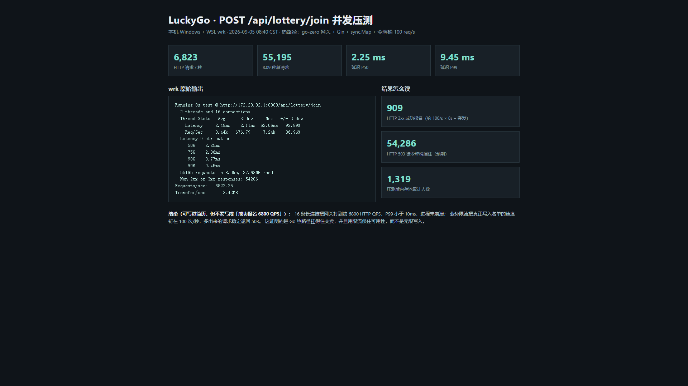
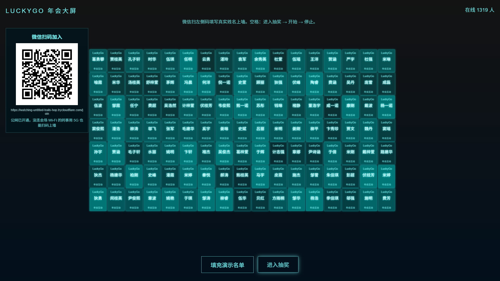

# LuckyGo

生产向的多租户抽奖 SaaS：商家配奖项与名单，现场大屏 3D 球体抽奖（live），或报名后到期公平开奖（scheduled）。前端 3D 球交互复刻 log-lottery，结果由 Go 后端原子裁决（Redis 名单池 SPOP / 种子洗牌），不靠前端随机。

边界条件见 [docs/production-edges.md](docs/production-edges.md)，立项见 [docs/project-charter.md](docs/project-charter.md)。

## 和 Demo 的差别

- 现场抽：Lua 一次完成状态/时间窗/名单池版本校验 + `SPOP N` 原子弹出 + 幂等键，重复中奖与超发在引擎单测里锁死。
- Redis 弹出后 MySQL 失败：重试落库 + `persist_failures` Worker 补偿，默认不回池；主持人「取消本次」才是唯一回池路径（批次翻 undone + 名单版本号触发池重建）。
- 名单双来源：Excel 导入（幂等 upsert）+ C 端用户报名自动上球；已中奖者禁止删除。
- 定时开奖：分布式锁 + 乐观锁，种子写入审计表可复盘；报名人数不足则流奖，不循环发。
- 兑换码只在中奖响应展示一次，库里存哈希；导入名单中奖者走「线下核销」补记。
- 所有业务表带 `tenant_id`；C 端用户不能跨租户抽；播报/公示名单脱敏。

## 本地启动

1. 启动 MySQL / Redis（Docker Desktop 打开后）：

```bash
docker compose -f deploy/docker-compose.yml up -d mysql redis
```

2. 后端：

```bash
go test ./internal/engine -count=1
go run ./app/gateway -f app/gateway/etc/luckygo-api.yaml
go run ./app/worker -f app/worker/etc/worker.yaml
```

3. 前端：

```bash
cd web/console
npm install
npm run dev
```

4. 冒烟（可选，覆盖 live 全流程：导入名单→发布→抽取→取消→核销→上传）：

```bash
python scripts/smoke-live.py
```

浏览器打开 http://localhost:5173/login 注册租户。年会互动大屏（扫码上球 + 3D 抽奖）直接打开：

http://localhost:5173/live

点登录页「年会大屏」或直接打开：

http://localhost:5173/live

**同事用微信扫大屏左侧二维码**，打开 `/join` 填写真实姓名，1 秒内名字出现在 3D 球上。主持人可点「填充演示名单」先铺一批暖场名字，不影响之后真实扫码加入。空格：**进入抽奖 → 开始 → 停止出结果**。抽中的人会从池里拿走，其余人继续留在球上。

手机扫码：同一 Wi‑Fi 可用大屏局域网地址（不要用 localhost）。**没连 Wi‑Fi、走 5G/流量**时，先保持前端 5173 和网关 8888 已启动，再开一条公网隧道：

```powershell
powershell -ExecutionPolicy Bypass -File scripts/expose-5173.ps1
```

脚本会优先用本机已装的 **cpolar / ngrok / cloudflared**，没有则自动下载 cloudflared 快速隧道。成功后把 `https://…` 写进 `.runtime/public-base.url`，大屏左侧二维码会在约 1 秒内换成公网地址。微信里更稳的是 cpolar（需官网免费账号 token：`cpolar authtoken <token>`）。有自己的 frp 机器时，参考 `scripts/frpc.lottery.toml.example`。

配置了微信认证服务号后，微信内打开报名页会走网页授权（openid 去重），仍要确认真实姓名。

原 SaaS 流程：创建 live 活动 → 名单管理导入 Excel → 发布。C 端链接在活动列表「复制C端链接」。

## 年会互动大屏（扫码上墙）

热路径仍是进程内 `sync.Map` + 全局限流 100 req/s；名单同时写入 MySQL `live_roster`，网关重启不会丢已扫码的人。抽奖只移除中奖者，不会清空全场。

| 方法 | 路径 | 说明 |
|------|------|------|
| GET | `/join` | 手机报名页（微信扫码落地） |
| GET | `/api/lottery/session` | 是否开启微信授权、已绑定状态 |
| POST | `/api/lottery/join` | 真实姓名报名；微信 cookie 优先作为 user_id |
| GET | `/api/lottery/participants` | 当前在池中的 `names` |
| POST | `/api/lottery/draw` | 随机抽 N 人并移出池 |
| POST | `/api/lottery/seed-mock` | 主持人填充演示名单 |
| GET | `/api/lottery/wechat/login` | 微信网页授权入口 |

`app/gateway/etc/luckygo-api.yaml` 里 `Wechat.AppId / AppSecret` 配认证服务号；网页授权回调为 `{PublicBaseUrl}/api/lottery/wechat/callback`。不配则扫码后手填姓名，局域网年会即可用。

压测 `POST /join`（本机 wrk 装在 WSL Ubuntu；脚本每次生成不同中文姓名。限流 100 次/秒，压满时会出现大量 503，进程应保持稳定）：

先打开大屏 `http://localhost:5173/live`，再在仓库根目录执行：

```powershell
# 看名字陆续上墙（约 5 人/秒，不走 wrk）
powershell -ExecutionPolicy Bypass -File scripts/wrk-join.ps1 -Watch

# 用 wrk 打一波随机姓名（2 线程 / 16 连接 / 8 秒）
powershell -ExecutionPolicy Bypass -File scripts/wrk-join.ps1

# 压到限流（4 线程 / 200 连接 / 10 秒，预期大量 503）
powershell -ExecutionPolicy Bypass -File scripts/wrk-join.ps1 -Stress
```

也可以在 WSL 里直接跑。WSL2 打不到 Windows 的 `127.0.0.1`，要用本机局域网 IP 或 WSL 网卡 IP（常见 `172.28.32.1`）：

```bash
wrk -t2 -c16 -d8s -s /mnt/d/1_code/Go-zero/scripts/lottery-join.lua http://172.28.32.1:8888/api/lottery/join
```

单测：

```bash
go test ./internal/lottery -count=1
```

## 并发压测结果（2026-09-05，可放简历）

本机 `wrk -t2 -c16 -d8s` 打 `POST /api/lottery/join`（每次随机中文姓名）。原始日志：`docs/loadtest/wrk-join-20260905.log`。

| 指标 | 实测 |
|------|------|
| HTTP QPS | **6823** |
| 总请求 / 时长 | 55195 / 8.09s |
| 延迟 P50 / P99 | 2.25ms / **9.45ms** |
| HTTP 2xx 成功报名 | 909（令牌桶 100/s + 突发） |
| HTTP 503 | 54286（限流预期，进程未崩溃） |
| 压测后在线人数 | 1319 |





根目录也各有一份同名 PNG：`wrk-join-result.png`、`live-concurrent-names.png`。

**简历不要写「成功报名 6800 QPS」。** 6800 是网关收包速率；真正写入名单被限流钉在 100 次/秒。建议写法：

- 使用 Go / go-zero 实现年会抽奖网关：扫码报名热路径为 `sync.Map` + 令牌桶，抽奖由 Redis Lua `SPOP` 原子弹出，结果不在前端随机。
- 本机 wrk（2 线程 / 16 连接 / 8s）将报名接口打到约 **6.8k HTTP QPS**，P99 **9.45ms**；过载请求稳定返回 503，成功写入约 100/s，压测后大屏展示 **1319** 人在线，进程未崩溃。
- 引擎单测覆盖并发抽取不重复、不超发、幂等重放与取消回滚（`go test ./internal/engine`）。

## 目录

- `app/gateway` go-zero REST（含图片上传与静态服务）
- `app/worker` 到期开奖 / 状态翻转 / 落库补偿
- `internal/engine` 名单池 SPOP / 种子洗牌（可单测）
- `internal/service` 业务
- `internal/lottery` 年会互动：Gin + sync.Map + MySQL 名单 + 微信扫码报名
- `web/console` 商家后台 + 年会 3D 大屏 `/live` + C 端活动页
- `migrations` 001 基础表 + 002 live 模式 + 003 年会扫码名单 `live_roster`
- `scripts/smoke-live.py` 端到端冒烟
- `scripts/lottery-join.lua` wrk 压测参与接口
